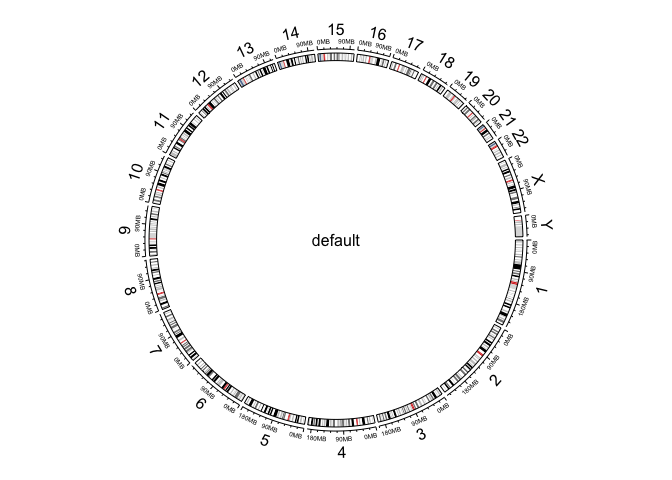
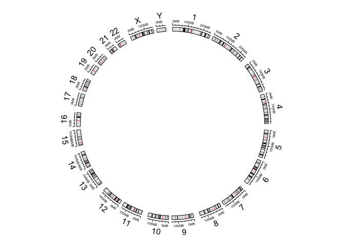
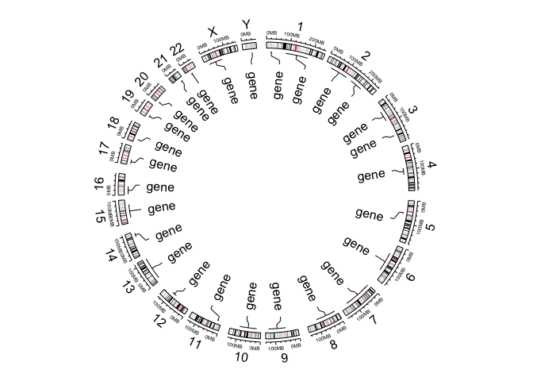
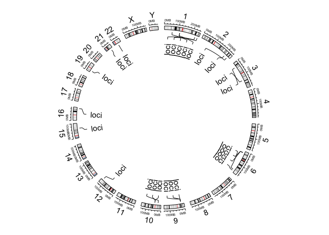
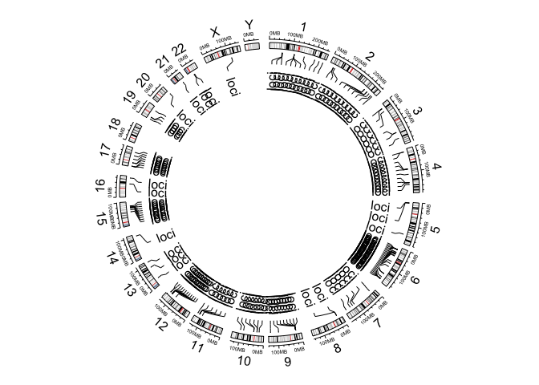
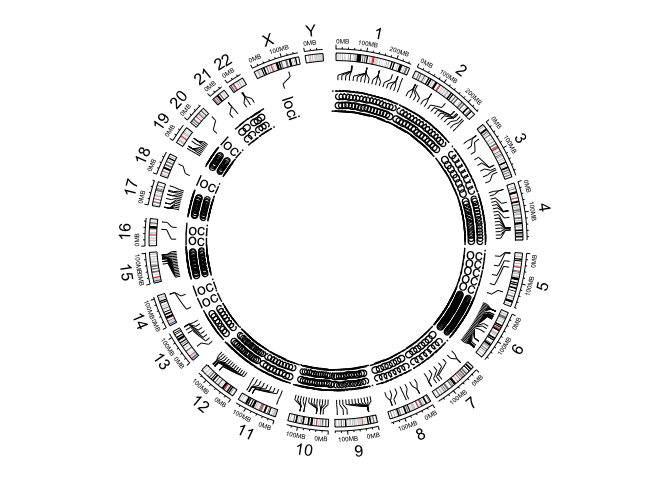
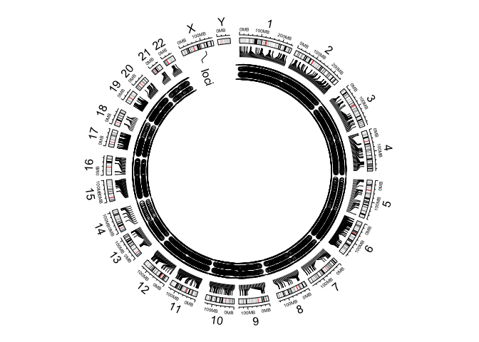

Load the necessary packages

```r
library(circlize)
```

```
## ========================================
## circlize version 0.4.3
## CRAN page: https://cran.r-project.org/package=circlize
## Github page: https://github.com/jokergoo/circlize
## Documentation: http://jokergoo.github.io/circlize_book/book/
## 
## If you use it in published research, please cite:
## Gu, Z. circlize implements and enhances circular visualization 
##   in R. Bioinformatics 2014.
## ========================================
```

Next step, we will generate a plain graph to see what we need to alter.


```r
circos.initializeWithIdeogram()
text(0, 0, "default", cex = 1)
```

<!-- -->

```r
circos.info()
```

```
## All your sectors:
##  [1] "chr1"  "chr2"  "chr3"  "chr4"  "chr5"  "chr6"  "chr7"  "chr8" 
##  [9] "chr9"  "chr10" "chr11" "chr12" "chr13" "chr14" "chr15" "chr16"
## [17] "chr17" "chr18" "chr19" "chr20" "chr21" "chr22" "chrX"  "chrY" 
## 
## All your tracks:
## [1] 1 2
## 
## Your current sector.index is chrY
## Your current track.index is 2
```

```r
circos.clear()
```

Things that I want to change:  
* Space between the chromosomes;  
* Start on chromosome 1;  
* Add points to correct places;  

Start altering the location and space


```r
circos.par("start.degree" = 90)
circos.par("gap.degree" = rep(c(2, 4), 12))
circos.initializeWithIdeogram()
```

<!-- -->

```r
circos.clear()
```

Testing with random data before I make my final figure


```r
circos.par("start.degree" = 90)
circos.par("gap.degree" = rep(c(2, 4), 12))
circos.initializeWithIdeogram()

bed = generateRandomBed(nr = 20, nc = 0)
circos.genomicPosTransformLines(bed, posTransform = posTransform.default, horizontalLine = "top", track.height = 0.1)

circos.genomicTrackPlotRegion(bed, ylim = c(0, 1), panel.fun = function(region, value, ...) {
    circos.genomicText(region, value, y = 1, adj = c(0, 0.5), labels = "gene", facing = "reverse.clockwise", niceFacing = TRUE,
        posTransform = posTransform.default)
}, bg.border = NA)
```

<!-- -->

```r
circos.clear()
```

Next things that I want to alter:  
1. Can I remove the "size" of the chromosome from the plot?  
2. Should I make each chromosome a solid color?

Add data that we need:


```r
snps.up.2010 <- read.csv("./create-circular-genomes_files/SNP-data/up-to-2010.csv", header=TRUE)
snps.2011.to.15 <- read.csv("./create-circular-genomes_files/SNP-data/2011-2015.csv", header=TRUE)
snps.2016 <- read.csv("./create-circular-genomes_files/SNP-data/2016.csv", header=TRUE)
snps.2017 <- read.csv("./create-circular-genomes_files/SNP-data/2017.csv", header=TRUE)

snps.up.2010 <- unique(snps.up.2010[order(snps.up.2010$chr),])
snps.2011.to.15 <- unique(snps.2011.to.15[order(snps.2011.to.15$chr),])
snps.2016 <- unique(snps.2016[order(snps.2016$chr),])
snps.2017 <- unique(snps.2017[order(snps.2017$chr),])
```

Now lets plot up to 2010

```r
circos.par("start.degree" = 90)
circos.par("gap.degree" = rep(c(2, 4), 12))
circos.initializeWithIdeogram()

circos.genomicPosTransformLines(snps.up.2010, posTransform = posTransform.default, horizontalLine = "top", track.height = 0.1)

circos.genomicTrackPlotRegion(snps.up.2010, ylim = c(0, 1), panel.fun = function(region, value, ...) {
    circos.genomicText(region, value, y = 1, adj = c(0, 0.5), labels = "loci", facing = "reverse.clockwise", niceFacing = TRUE,
        posTransform = posTransform.default)
}, bg.border = NA)
```

<!-- -->

```r
circos.clear()
```

Plotting up to 2015

```r
circos.par("start.degree" = 90)
circos.par("gap.degree" = rep(c(2, 4), 12))
circos.initializeWithIdeogram()

up.2015 <- merge(snps.up.2010, snps.2011.to.15, all=TRUE)
circos.genomicPosTransformLines(up.2015, posTransform = posTransform.default, horizontalLine = "top", track.height = 0.1)

circos.genomicTrackPlotRegion(up.2015, ylim = c(0, 1), panel.fun = function(region, value, ...) {
    circos.genomicText(region, value, y = 1, adj = c(0, 0.5), labels = "loci", facing = "reverse.clockwise", niceFacing = TRUE,
        posTransform = posTransform.default)
}, bg.border = NA)
```

<!-- -->

```r
circos.clear()
```

Now lets plot up to 2016

```r
circos.par("start.degree" = 90)
circos.par("gap.degree" = rep(c(2, 4), 12))
circos.initializeWithIdeogram()

up.2016 <- merge(up.2015, snps.2016, all=TRUE)
circos.genomicPosTransformLines(up.2016, posTransform = posTransform.default, horizontalLine = "top", track.height = 0.1)

circos.genomicTrackPlotRegion(up.2016, ylim = c(0, 1), panel.fun = function(region, value, ...) {
    circos.genomicText(region, value, y = 1, adj = c(0, 0.5), labels = "loci", facing = "reverse.clockwise", niceFacing = TRUE,
        posTransform = posTransform.default)
}, bg.border = NA)
```

<!-- -->

```r
circos.clear()
```

Now lets plot up to 2017

```r
circos.par("start.degree" = 90)
circos.par("gap.degree" = rep(c(2, 4), 12))
circos.initializeWithIdeogram()

up.2017 <- merge(up.2016, snps.2017, all=TRUE)
circos.genomicPosTransformLines(up.2017, posTransform = posTransform.default, horizontalLine = "top", track.height = 0.1)
```

```
## Note: 2 points are out of plotting region in sector 'chr20', track '3'.
## 
## Note: 2 points are out of plotting region in sector 'chr20', track '3'.
## 
## Note: 2 points are out of plotting region in sector 'chr20', track '3'.
## 
## Note: 2 points are out of plotting region in sector 'chr20', track '3'.
```

```
## Note: 1 point is out of plotting region in sector 'chr20', track '3'.
## 
## Note: 1 point is out of plotting region in sector 'chr20', track '3'.
```

```r
circos.genomicTrackPlotRegion(up.2017, ylim = c(0, 1), panel.fun = function(region, value, ...) {
    circos.genomicText(region, value, y = 1, adj = c(0, 0.5), labels = "loci", facing = "reverse.clockwise", niceFacing = TRUE,
        posTransform = posTransform.default)
}, bg.border = NA)
```

<!-- -->

```r
circos.clear()
```
